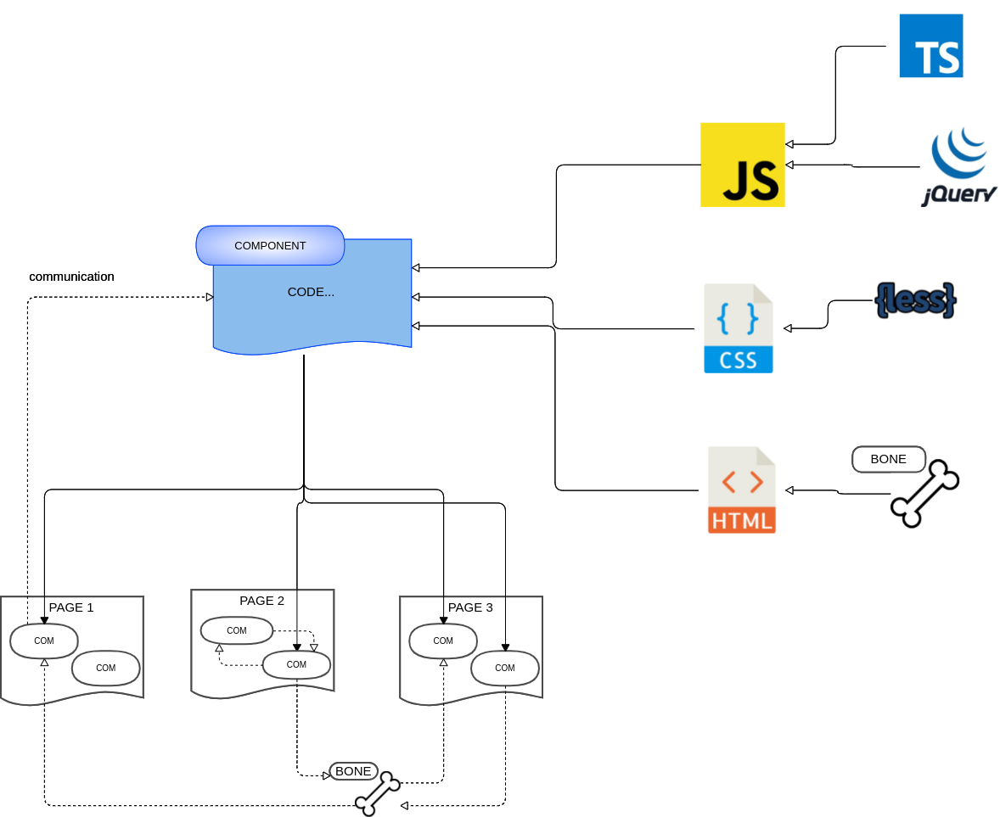

# Componentes Skeleton

Los componentes son trozos de código independientes que generan un objeto html con características singulares.  
Son objetos encapsulados con una estructura HTML , un diseño CSS, y un comportamiento con JS.  
Ayudan a crear aplicaciones más fáciles de diseñar y mantener.  
Son fácilmente reutilizables, minimizan y homogenizan todo muestro código.  

Para un mayor dinamismo cuenta con distintas tecnologías para darle mayor funcionalidad:  



### Component 
    La forma de crearlo es en un archivo con el nombre del componente que se desea.
    Se debe iniciar y acabar con el pseudo-tag component <code>&lt;component id=""&gt;Codigo...&lt;/component&gt;</code>. 
    Dentro de el incluiremos la estructura html, js y css si se desea, y será precompilada con las directivas Bone. 

    Podemos encapsularle unos estilos propios mediante el tag <code>&lt;style lang="" scoped&gt;&lt;style&gt;</code> con el atributo lang se declarará el sublenguaje que se esté empleando: Lesscss, Sass etc..
    Para añadir la funcionalidad al componente se declara la etiqueta &lt;script scope&gt;&lt;script&gt;

    Los atributos que se le pasan al componente a su llamada se declaran como variables Bone. 

### Ejemplo botón
Ejemplo de un componente botón:  
``<m-btn onclick="alert(`Hay que poner estas comillas para que lo reconozca`)"></m-btn>``

`src/mycomponents/m-btn.phtml`
```
<component id="--id"> 
    <button type = "submit" id="--id_el"  class="$$class collapse tertiary" placeholder=" "
            name = "$$name" tile = "$$tile"
            value = "$$value" tabindex = "$$tabindex" onfocus = "$$onfocus" onblur = "$$onblur" onclick = "$$onclick"
            onkeypress = "$$onkeypress" onkeydown = "$$onkeydown" onkeyup = "$$onkeyup"
            onchange = "$$onchange" $$require $$disabled $$readonly $$checked  
        >
        @if ($$spinner) <i class="spinner hidden"></i> @endif
        @if ($$icon) <i class="lnr lnr-$$icon"></i> @endif
        @if ($$caption) 
            <span class="caption">$$caption</span> 
        @else
            <span class="caption">Aceptar</span> 
        @endif
        
    </button>
</component>
```
Procesado de la salida al archivo .php:  
`<?php $c = new \core\Component('m-btn-success', '[]', ''); $c->print();?>`

Resultado html:  
```<button type="submit" id="tag619cca9846628_el" class=" collapse tertiary" placeholder=" ">
    <span class="caption">Aceptar</span> 
</button>
```

 
    La forma de crearlo es en un archivo con el nombre del componente que se desea. <br>
    Se debe iniciar y acabar con el pseudo-tag component <code>&lt;component id=""&gt;Codigo...&lt;/component&gt;</code>. <br>
    Dentro de el incluiremos la estructura html, js y css si se desea, y será precompilada con las directivas Bone. <br>

    Podemos encapsularle unos estilos propios mediante el tag <code>&lt;style lang="" scoped&gt;&lt;style&gt;</code> con el atributo lang se declarará el sublenguaje que se esté empleando: Lesscss, Sass etc.. <br>
    Para añadir la funcionalidad al componente se declara la etiqueta &lt;script scope&gt;&lt;script&gt; <br>

    Los atributos que se le pasan al componente a su llamada se declaran como variables Bone. 
   