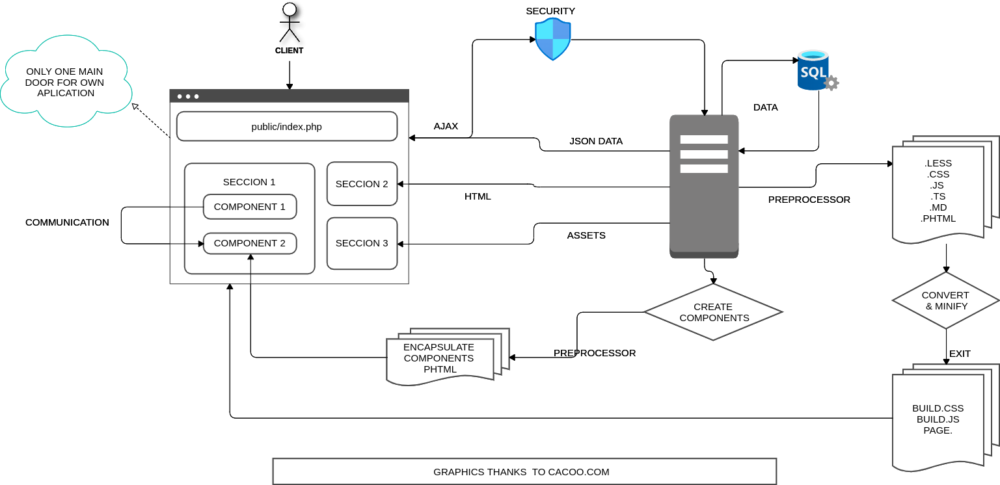

# SkeletonPHP

Framework de trabajo con carga rapida y modular con tecnologías asentadas como son PHP, JS y CSS. 
Carga modular de cualquier contenido sin tener que repetir la total carga de todo el contenido de la aplicación.
Modulos personalizados eliminando la rebundancia de código facilitando el trabajo y la legibilidad del codigo.

## Licencia
Este proyecto está bajo la Licencia [MIT](https://opensource.org/licenses/MIT) - mira el archivo [LICENSE.md](LICENSE.md) para más detalles. 

⌨Con ❤️ por [Néstor Pons](https://github.com/nestorpons) 😊

Icons made by <a href="https://www.freepik.com" title="Freepik">Freepik</a> from <a href="https://www.flaticon.com/" title="Flaticon">www.flaticon.com</a>
